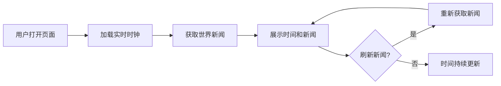

## 1. 产品概述
一个实时显示时间和世界新闻的静态页面，为用户提供简洁高效的信息获取体验。
- 主要用途：实时展示当前时间、日期和全球新闻资讯
- 目标用户：需要快速获取时间和新闻的互联网用户

## 2. 核心功能

### 2.1 用户角色
| 角色 | 注册方式 | 核心权限 |
|------|----------|----------|
| 普通用户 | 无需注册 | 浏览时间和新闻内容 |

### 2.2 功能模块
1. **时间展示模块**：实时时钟、日期显示、时区切换
2. **新闻展示模块**：世界新闻列表、新闻分类、新闻详情

### 2.3 页面详情
| 页面名称 | 模块名称 | 功能描述 |
|----------|----------|----------|
| 首页 | 实时时钟 | 显示当前时间，每秒更新，支持多种格式 |
| 首页 | 日期显示 | 显示当前日期、星期、月份 |
| 首页 | 新闻列表 | 展示世界新闻，支持自动刷新和手动刷新 |

## 3. 核心流程
用户打开页面 → 自动加载实时时间 → 自动获取并展示世界新闻 → 用户可手动刷新新闻 → 时间持续更新

## 4. 用户界面设计

### 4.1 设计风格
- 主色调：深蓝色背景配合白色文字，营造科技感和专业感
- 按钮样式：圆角矩形，悬停时有渐变效果
- 字体：使用现代无衬线字体，清晰易读
- 布局：卡片式布局，信息层次分明
- 图标：使用简洁的线性图标

### 4.2 页面设计概述
| 页面名称 | 模块名称 | UI元素 |
|----------|----------|--------|
| 首页 | 实时时钟 | 大号数字显示，毫秒级跳动动画 |
| 首页 | 日期显示 | 优雅的日期排版，星期高亮 |
| 首页 | 新闻列表 | 卡片式新闻卡片，带图片和摘要 |

### 4.3 响应式设计
- 桌面端：完整布局，时间在左侧，新闻在右侧
- 移动端：时间在顶部，新闻在下方，垂直排列

### 4.4 动效设计
- 时钟数字平滑过渡动画
- 新闻卡片悬停缩放效果
- 新闻加载骨架屏动画
