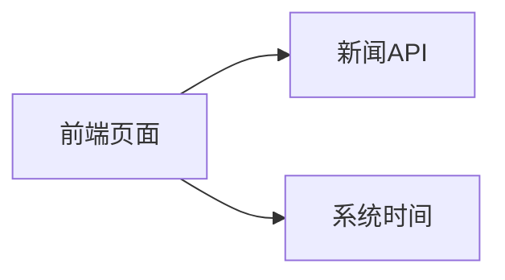

## 1. 架构设计



## 2. 技术描述
- 前端：React@18 + TailwindCSS@3 + Vite
- 初始化工具：vite-init
- 后端：无（纯前端项目）
- 数据：使用NewsAPI获取真实新闻数据，支持Mock数据备用

## 3. 路由定义
| 路由 | 用途 |
|------|------|
| / | 首页，显示时间和新闻 |

## 4. API定义

### 4.1 NewsAPI接口
- **接口地址**: `https://newsapi.org/v2/top-headlines`
- **请求方法**: GET
- **请求参数**:
  - country: 国家代码（默认us）
  - apiKey: API密钥
- **响应结构**:
```typescript
interface NewsResponse {
  status: string;
  totalResults: number;
  articles: Article[];
}

interface Article {
  source: {
    id: string | null;
    name: string;
  };
  author: string | null;
  title: string;
  description: string | null;
  url: string;
  urlToImage: string | null;
  publishedAt: string;
  content: string | null;
}
```

## 5. 数据模型

### 5.1 新闻数据模型
| 字段名 | 类型 | 说明 |
|--------|------|------|
| title | string | 新闻标题 |
| description | string | 新闻描述 |
| url | string | 新闻链接 |
| urlToImage | string | 新闻图片 |
| source | string | 新闻来源 |
| publishedAt | string | 发布时间 |

## 6. 项目结构
```
src/
  ├── components/
  │   ├── Clock.tsx          # 实时时钟组件
  │   ├── DateDisplay.tsx    # 日期显示组件
  │   └── NewsCard.tsx       # 新闻卡片组件
  ├── hooks/
  │   ├── useClock.ts        # 时钟hook
  │   └── useNews.ts         # 新闻获取hook
  ├── utils/
  │   └── newsApi.ts         # 新闻API封装
  ├── App.tsx                # 主应用组件
  ├── main.tsx               # 入口文件
  └── index.css              # 全局样式
```
